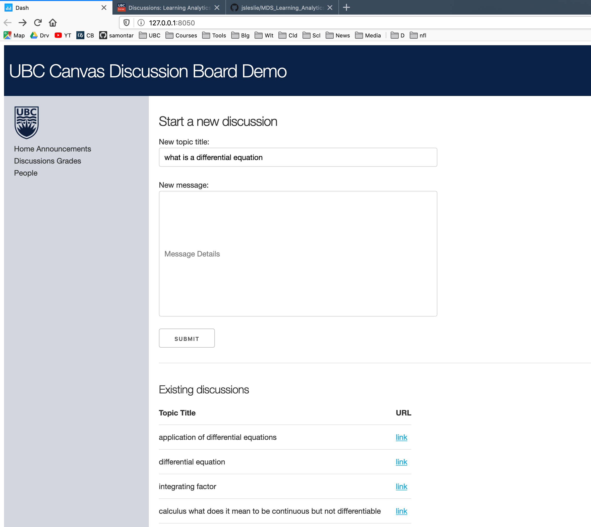

# MDS Learning Analytics

UBC Learning Analytics Hackathon

### Problem

- Canvas discussion boards are too cluttered and may be intimidating for students

### Goal

- Make the canvas discussion environment more user friendly and helpful for students
- Encourage student participation on canvas in getting their questions asked

### Tool

Screenshot of web app:

